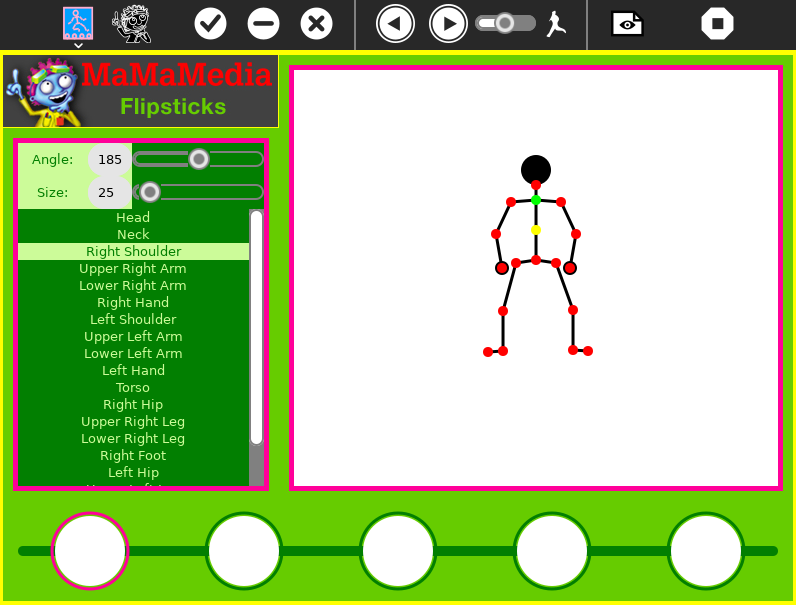

What is this?
=============

Flipsticks is a NEW keyframe animation activity that lets you pose and program a stick figure to walk, run, rotate, twist, tumble and dance. You can save your animations to the journal and will soon be able to share them via the mesh. Flipsticks can be used to explore concepts in geometry, computer programming and animation; it helps develop spatial and analytical thinking skills.



How to use?
===========

Flipsticks is not part of the Sugar desktop, but can be added.  Please refer to;

* [How to Get Sugar on sugarlabs.org](https://sugarlabs.org/),
* [How to use Sugar](https://help.sugarlabs.org/),
* [Download Flipsticks using Browse](https://activities.sugarlabs.org/), search for `Flips Sticks`, then download, and;
* Refer the 'How to play' section inside the activity

How to upgrade?
===============

On Sugar desktop systems;
* use [My Settings](https://help.sugarlabs.org/my_settings.html), [Software Update](https://help.sugarlabs.org/my_settings.html#software-update), or;
* use Browse to open [https://activities.sugarlabs.org](https://activities.sugarlabs.org), search for `Flip Stciks`, then download.

How to run?
=================

Flipsticks depends on Python, PyGTK and PyGame.

Flipsticks is started by [Sugar](https://github.com/sugarlabs/sugar).

**Running inside Sugar**

- Activity can be run from the activity ring, you'll open
  terminal activity and clone the activity first.
```
git clone https://github.com/sugarlabs/flipsticks
```

- Change to the flipsticks activity directory
```
cd Activities/flipsticks
# Set up activity for development 
python3 setup.py dev
```

- Go to activity ring and search for flipsticks and run.

- Activity can also be run from the terminal by running while in
  activity directory
```
sugar-activity3 .
```

Reporting Bugs
--------------

Bugs can be reported in the
[issues tab](https://github.com/sugarlabs/flipsticks/issues)
of this repository.

Contributing
------------

Please consider [contributing](https://github.com/sugarlabs/sugar-docs/blob/master/src/contributing.md) to the project with your ideas and your code.
